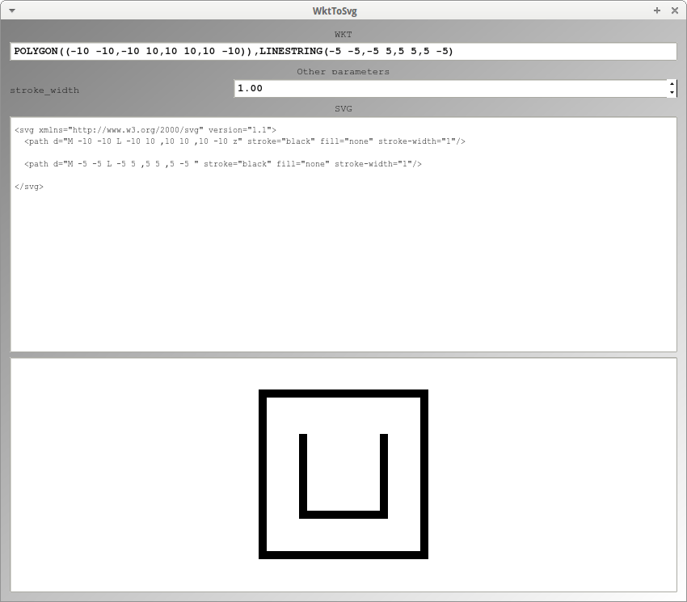

# WktToSvg

Tool to convert WKT to SVG, written in C++ using Qt.

## Link

- [`wkt2svg` as part of a Rust module](https://github.com/Notgnoshi/generative?tab=readme-ov-file#wkt2svg): more features, command-line interface
